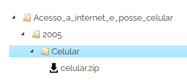

# Desafio Técnico Tact

Base de dados escolhida:



**Base título:** Tabelas - Posse de telefone móvel celular para uso pessoal  
**Tabela escolhida:** Tabela 2.1.1 - Pessoas de 10 anos ou mais de idade que tinham telefone móvel celular para uso pessoal, por Grandes Regiões, segundo o sexo e os grupos de idade - 2005  
**Fonte:** [ibge.gov.br](https://www.ibge.gov.br/estatisticas/downloads-estatisticas.html)

---

## Contexto

API REST desenvolvida em Django que processa e disponibiliza dados do IBGE sobre posse de telefone móvel celular para uso pessoal no Brasil em 2005, segmentados por faixa etária e grande região, disponibilizados através de um dashboard.

---

## Pré-requisitos

- [Docker](https://www.docker.com/)
- [Docker Compose](https://docs.docker.com/compose/)
- [VS Code](https://code.visualstudio.com/) com a extensão [Live Server](https://marketplace.visualstudio.com/items?itemName=ritwickdey.LiveServer)

---

## Como rodar

### 1. Backend (Docker)

```bash
# Clone o repositório
git clone https://github.com/seu-usuario/desafio-tecnico-tact.git
cd desafio-tecnico-tact

# Suba os containers
docker-compose up --build
```

A API estará disponível em `http://localhost:8000`.

> O banco de dados é criado e populado automaticamente com os dados do CSV na primeira execução.

---

### 2. Frontend (VS Code + Live Server)

1. Abra a pasta do projeto no VS Code
2. Navegue até o arquivo `front-end/index.html`
3. Clique com o botão direito no arquivo e selecione **"Open with Live Server"**

O dashboard abrirá automaticamente em `http://127.0.0.1:5500`.

> Certifique-se de que o backend já está rodando antes de abrir o frontend.

---

## Rotas da API

| Método | Rota | Descrição |
|--------|------|-----------|
| GET | `/api/censo/` | Lista todos os registros brutos do censo |
| GET | `/api/summary/` | Total de posses no Brasil, região líder e faixa etária líder |
| GET | `/api/ranking/` | Ranking das regiões por total de posse de celular |
| GET | `/api/participacao/` | Participação percentual de cada região no total nacional |
| GET | `/api/heatmap/` | Distribuição por faixa etária e região (para heatmap) |
| GET | `/api/dominante-regiao/` | Faixa etária dominante em cada região |
| GET | `/api/dashboard/` | Todos os dados consolidados em uma única resposta |

---

## Parar a aplicação

```bash
# Para os containers
docker-compose down

# Para os containers e apaga o banco de dados
docker-compose down -v
```
